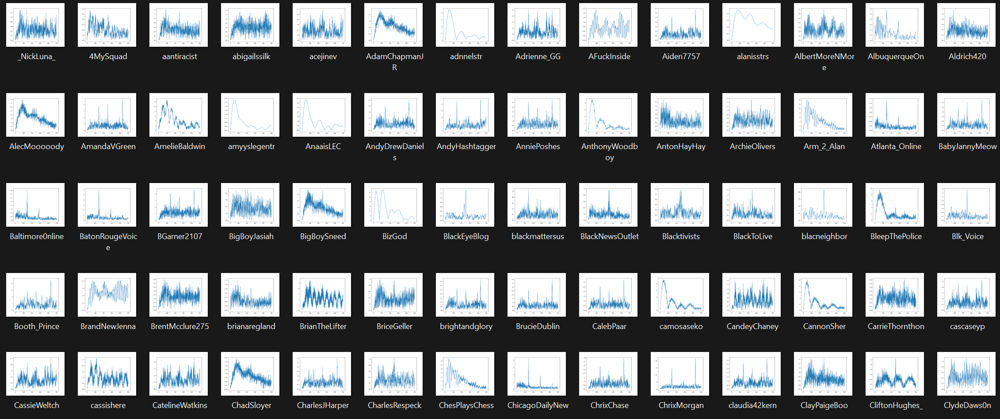

# twitter-study

In this research project, I was given a large dataset containing 2.4 millions twitter users. First I convert Unix time in original dataset to dates and selected a few thousand of users who has been active for more than 2 years. Then I ran Fast Fourier Transform with detrending moving averages to visualize the posting frequency of all users.

Here is an of how the results look like

For each user, I took the norm at all points and group them into bins of 5. Then I take the max, mean and standard deviation of each bin. If the difference between max and mean is larger than twice of the standard deviation, we say there is a dominant frequency at this bin. For example, in the following graph, we can see there is a very high spike at position between 200 and 300, so we can use total active days divided by that position to compute frequency this user posts.

At this stage, I noticed users have peaks that can produce harmonic frequencies which could be distraction to the above algorithm so I ran [ARMA](https://en.wikipedia.org/wiki/Autoregressive%E2%80%93moving-average_model) modelling on the outputs in previous step, and only record those with smallest [AIC](https://en.wikipedia.org/wiki/Akaike_information_criterion). After that, all users with posting frequencies close to integers are labeled as bots. This algorithm managed to detect more than 90% active bots among the original 2.4 millions users.

At last, I ran [MFDFA](https://github.com/LRydin/MFDFA) on the original data of some active bots to see if there is a linear fit. Here is an overview of the results.

Here are some python [programs] I wrote for this project. 
